# Custom_Yolov8
Labeling and training of a custom dataset

 

  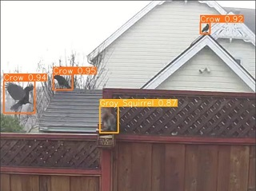

 
Head over to the <a href="https://roboflow.com/">Roboflow website</a> and sign up for personal use.
 

  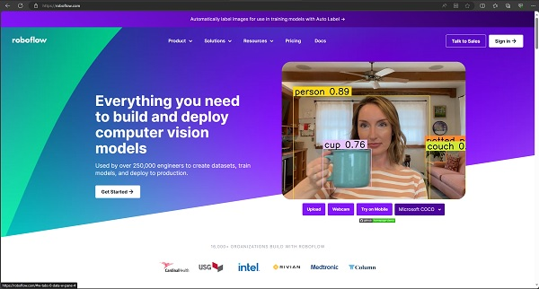

 
Click on "Upload Data" on the left menu.
 

  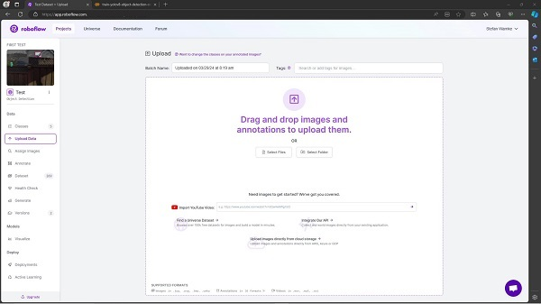

 
Upload all images to be labeled and used for the training.
 

  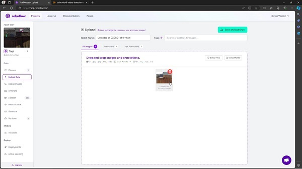

 
Label each image by starting at one corner and drag to the diagonal corner.
 

  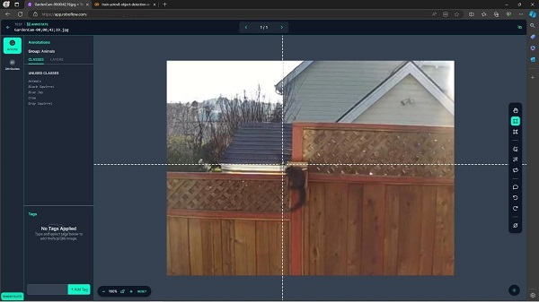

 
In the appearing dialog type in the name or select one of the listed ones.
 

  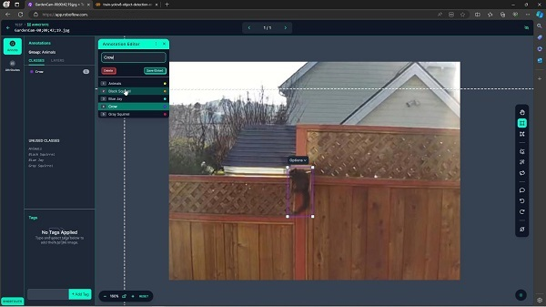

 
After all images are labeled, assign all of them to the dataset.
 

  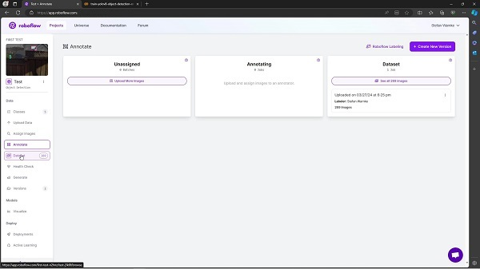

 
Take a look at the dataset images.
 

  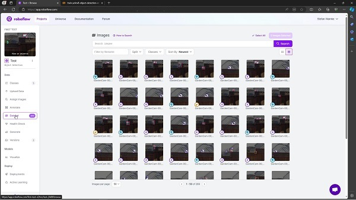

 
On the "Generate" page add some augmentations.
 

  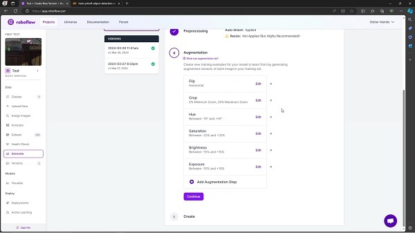

 
Last check and create the dataset.
 

  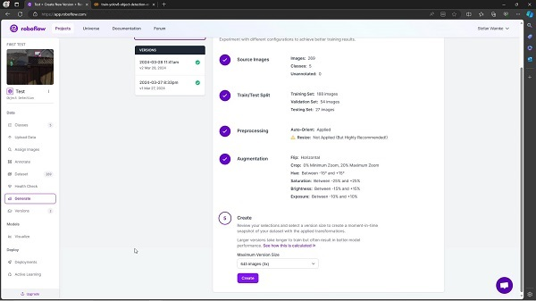

 
Export Dataset on the next page.
 

  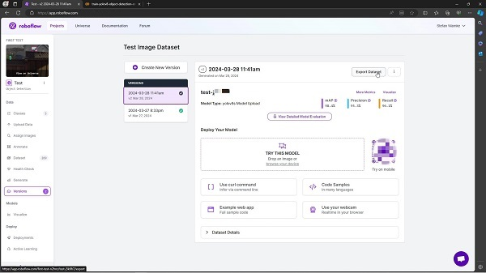

 
The opening dialog will provide a code snippet to be copied into a jupyter notebook for accessing the dataset. Hit the copy icon.
 

  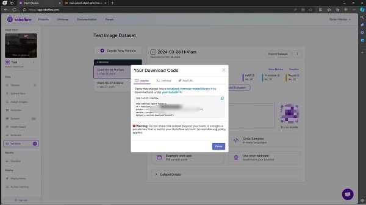

 
Roboflow provides a colab notebook, that can be used directly. However, there are a number of code cells for additional testing etc. So I deleted those, changed the traing model from "yolov8s.pt" to "yolov8n.pt" and provided a minimalized version here.
 

  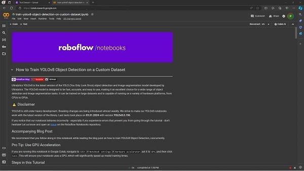

 
Look for this code cell and paste the copied code snippet from your dataset here replacing the highlighted ones.
 

  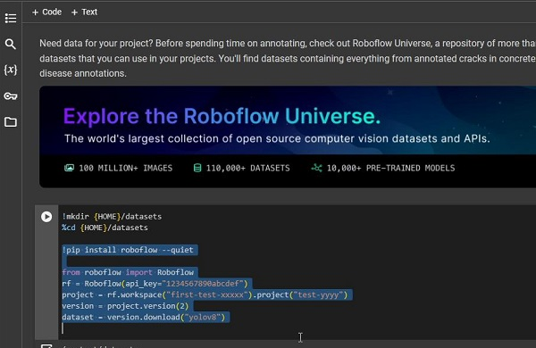

 
Run all and check the results.
 

  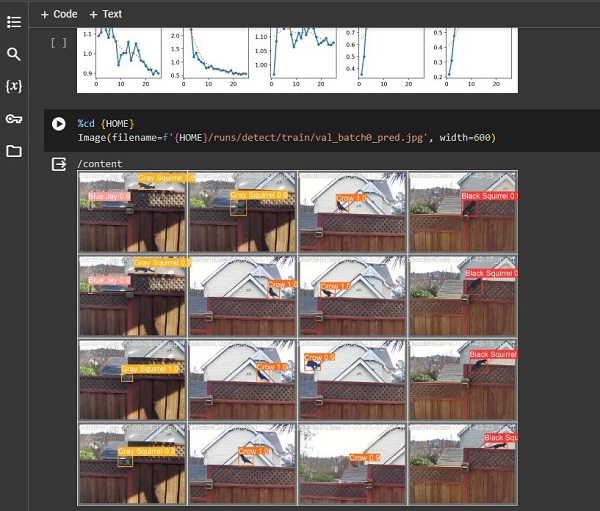

 
I added these cells at the end to automatically download the resulting model file "best.pt" to the local Download folder. This model file can now be renamed and copied to the target platform.
 

  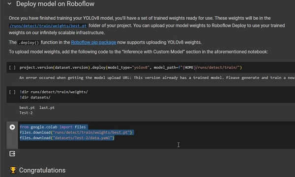

 
 
 
<a href="https://youtube.com/">Youtube video</a>
 
